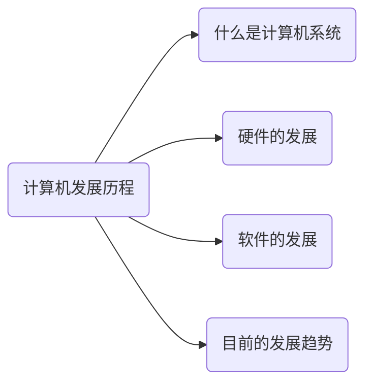
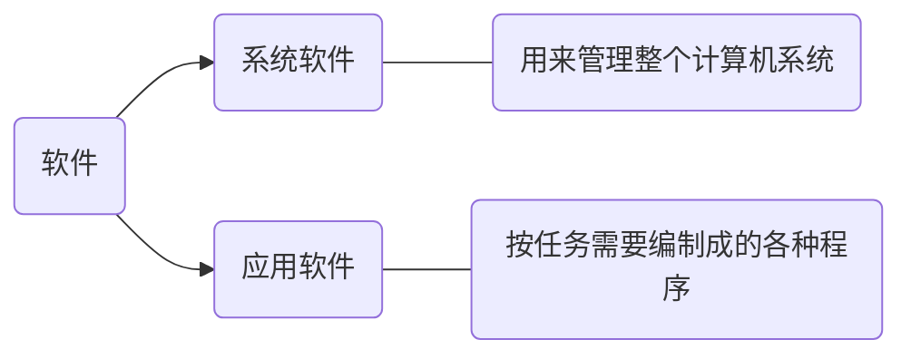
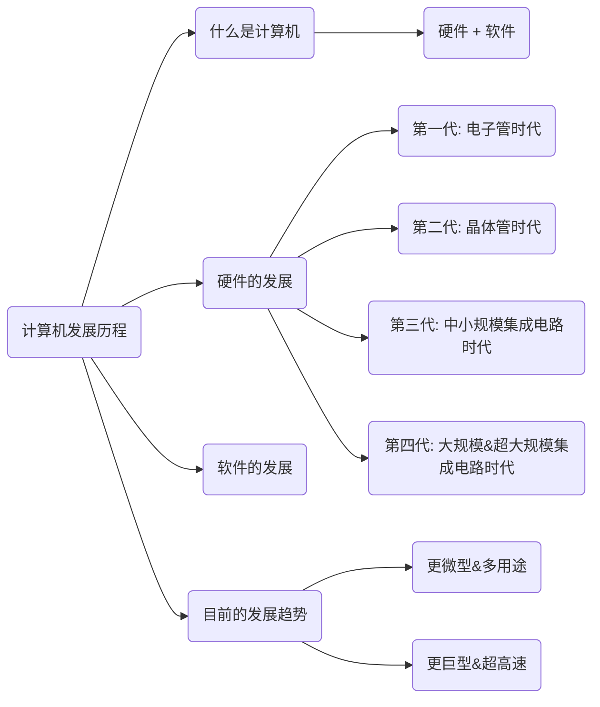

## 第一章 计算机系统概述

### 知识总览

### 什么是计算机系统

计算机系统 = 硬件 + 软件

* 硬件：计算机的实体，如主机、外设等。  
* 软件：由具有各类特殊功能的程序组成。


计算机性能的好坏取决于“软”、“硬”件功能的总和。




* 系统软件：  
 Eg：操作系统、数据库管理系统（DBMS）、标准程序库、网络软件、语言处理器、服务程序
* 应用软件：  
 Eg: BiliBili、原神、知乎、迅雷……



### 硬件的发展

第一台**电子数子**计算机：ENIAC（1946年）

* 占地面积约 170 平方米  
* 耗电量 150 千瓦  
* 运算速度：5000 次加法/秒
* 逻辑元件：电子管

#### 计算机的发展阶段

| 发展阶段 |    时间     |         逻辑元件         |  速度（次/秒）  |      内存      |              外存              |
| :------: | :---------: | :----------------------: | :-------------: | :------------: | :----------------------------: |
|  第一代  | 1946 - 1957 |          电子管          |   几千 - 几万   | 汞延迟线、磁鼓 |         穿孔卡片、纸带         |
|  第二代  | 1958 - 1964 |          晶体管          |  几万 - 几十万  |   磁芯存储器   |              磁带              |
|  第三代  | 1964 - 1971 |     中小规模集成电路     | 几十万 - 几百万 |  半导体存储器  |           磁带、磁盘           |
|  第四代  | 1972 - 现在 | 大规模、超大规模集成电路 |  上千万 - 万亿  |  半导体存储器  | 磁盘、磁带、光盘、半导体存储器 |

#### 八叛逆和仙童半导体诞生

* 1947年，贝尔实验室，发明了
* 1955年，肖克力在硅谷创建「肖克力实验室股份有限公司」
* 1957年，八叛逆（traitorous eight）创立了仙童半导体公司
* 1959年，仙童半导体公司发明了
* 1968年，摩尔等人离开仙童，创立 Inter
* 1969年，仙童销售部负责人桑德斯离开仙童，创立 AMD

#### 摩尔定律


揭示了信息技术进步的速度  
集成电路上可容纳的晶体管数目，约每 18 个月便会增加一倍，整体性能也将提升一倍。


#### 软件的发展

### 目前的发展趋势

“两级”分化：
微型计算机向更微型化、网络化、高性能、多用途反向发展；
另一极是巨型机向更巨型化、超高速、并行处理、智能化方向发展。

### 总结

